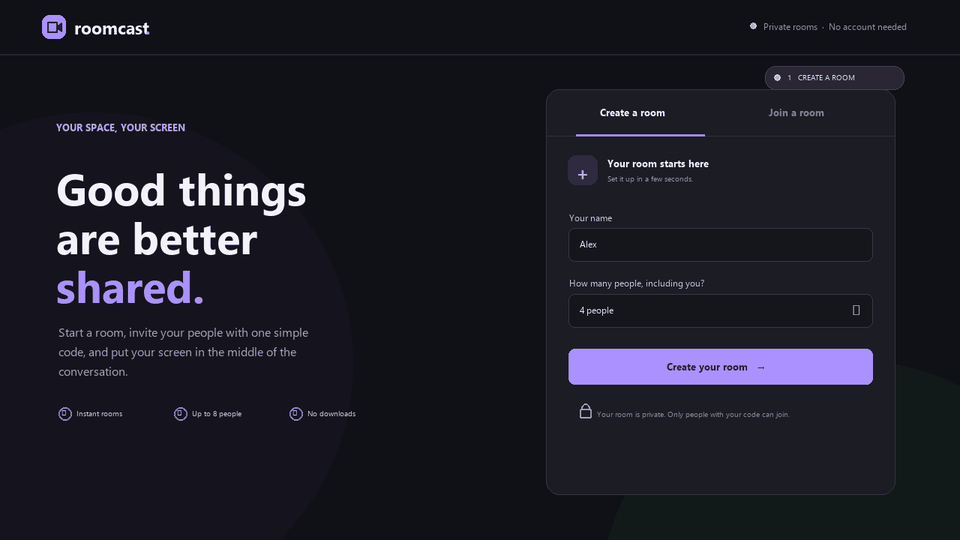
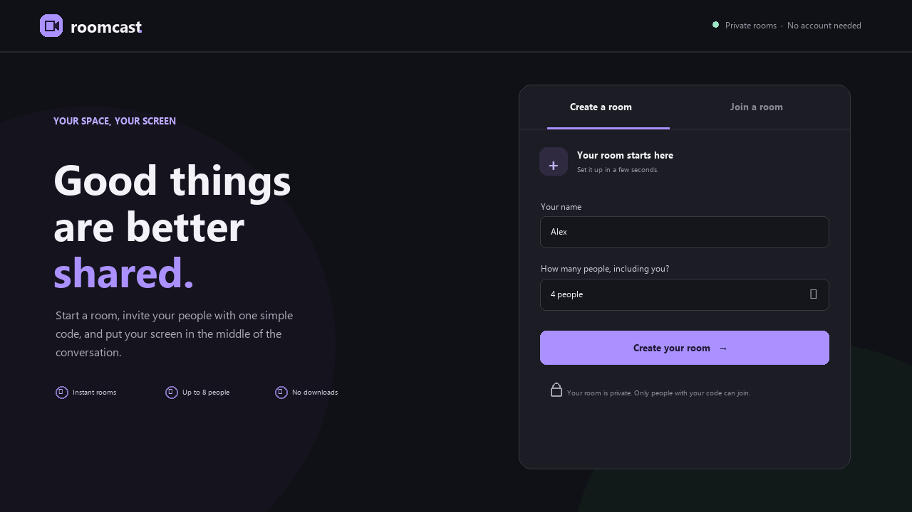
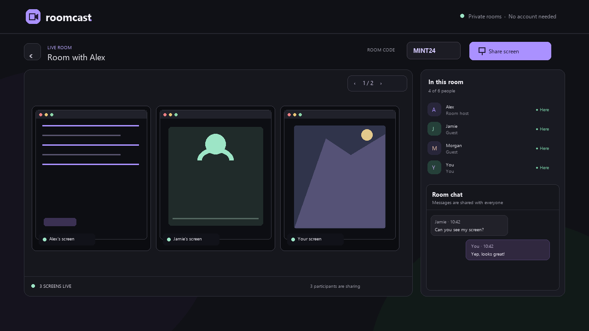

# Roomcast — multiuser screen sharing

Roomcast lets a host open a private room, choose a participant limit, and invite guests with a short code. Everyone in the room can chat and share their screen; up to three shares appear as tiles at once, with arrow buttons to page through additional shares. It uses WebRTC for screen streams and a small WebSocket server to manage room codes, chat, and participant connections.

## Quick video walkthrough

## What it does

- A host creates a room and chooses the maximum number of people, including themselves.
- Guests join with the room code and a display name. Rooms hold up to eight people.
- Everyone can chat and share their screen at the same time. Three screen tiles are shown per page; use **<** and **>** to browse more.
- The host can copy the room code to invite people. Leaving the room or restarting the server closes it.

## Pictures

These illustrations use sample names and chat messages to show the app layout.

### Create a room

Choose a display name and the room size, then create the room. The room code appears after it opens.

### Share screens and chat

Room members, live screen tiles, the page controls, and chat appear together in the room.

## How it works

1. The server creates a short code and reserves a room with the selected capacity.
2. Guests enter the code. The server checks that the room exists and has space.
3. WebSocket messages carry room updates, chat, and WebRTC connection setup. Screen video then travels directly between participants using WebRTC.
4. Each person's shared screen gets its own tile. The page arrows show the next three shares when there are more than three.

Room information and the latest 100 chat messages are kept in server memory only. There are no persistent user accounts or room records.

## Run Roomcast

1. Install [Node.js](https://nodejs.org/) 18 or later.
2. In this folder, run `npm install` once.
3. Start the app with `npm start`.
4. Open `http://localhost:3000`, create a room, and share its code with guests.

The host chooses a room size from 2 to 8 people (including the host). Guests enter the code and their display name to join. Screen capture requires a secure browser context; `localhost` works for local use. When hosting on a network or the internet, serve the site over HTTPS/WSS. Some networks also require a TURN server for WebRTC connections; configure one in `public/app.js` if STUN alone cannot connect participants.

Rooms and codes live in the server's memory and are removed when the host leaves or the server restarts. Roomcast does not have persistent user accounts.

## Privacy and safety

The extension communicates with `127.0.0.1` (your own computer) only, unless you deliberately change the server block. A local model may still give inaccurate or unsuitable answers; provide appropriate instructions and do not use its replies for safety-critical decisions.

## Troubleshooting

- **Cannot reach the local server:** confirm the server is running, then check its URL and port. LM Studio is normally `1234`; Ollama is normally `11434`.
- **Browser/CORS error:** configure the local server to accept requests from the PenguinMod editor's origin. The extension cannot bypass browser security.
- **Model not found:** run the available-models block and paste the exact returned name into `use model [ ]`.
- **Reply is empty:** check the `local AI error` reporter; some servers use different model identifiers or API settings.

## Go Online

- https://adhrit-roomcast-screen-share-v1-0-0.onrender.com
